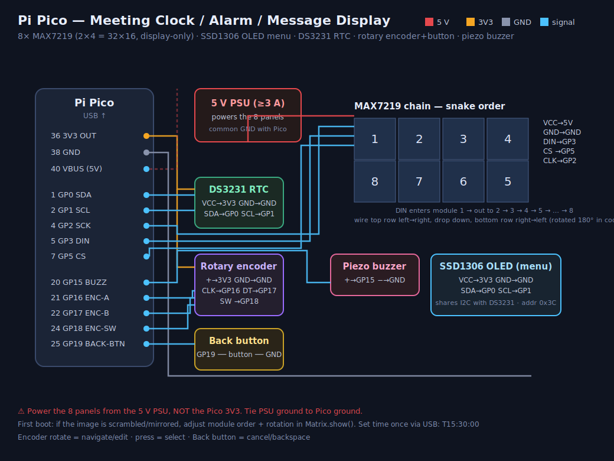

# Clockmatrix

A desk clock / meeting reminder / alarm / scrolling-message display built on
a Raspberry Pi Pico (MicroPython). A large LED matrix shows the time and a
scrolling ticker; a small OLED provides a fully interactive menu (rotary
encoder + button) for configuration, entirely off the main display.

The matrix panel **never** shows menus — only the clock, the scrolling
meeting/message ticker, and the alarm flash. All configuration lives on the
OLED, driven by the rotary encoder and two buttons.

## Features

- Live clock on a 32×16 LED matrix (8× daisy-chained MAX7219 8×8 modules)
- Scrolling ticker of meetings and custom/quick messages
- Alarms with a piezo buzzer
- RTC-backed timekeeping (DS3231) so the clock survives power loss
- On-device OLED menu (128×64 SSD1306) for setting time/date, adding
  alarms/meetings, typing messages, adjusting brightness, and toggling a
  clock entry in the ticker
- PC-side companion script to push the time, ad-hoc messages, and alarms
  over USB serial, plus one-shot or `--watch`-polled sync of today's Google
  Calendar events (or an offline `.ics` file) as scrolling meeting entries

## Hardware

| Component | Detail |
|---|---|
| MCU | Raspberry Pi Pico (RP2040), MicroPython |
| Matrix | 8× MAX7219 8×8 modules, arranged 2 rows × 4 cols (32×16 logical) — SPI, display-only |
| OLED | SSD1306 128×64, I2C addr 0x3C — all menus/UI |
| RTC | DS3231, I2C addr 0x68 — shares the OLED's I2C bus |
| Input | KY-040 rotary encoder + push button, separate back button |
| Buzzer | Piezo, PWM-driven |

### Pin assignments

| Function | GPIO |
|---|---|
| Matrix SPI SCK / MOSI / CS | 2 / 3 / 5 |
| I2C SDA / SCL (OLED + RTC) | 0 / 1 |
| Encoder A / B / SW | 16 / 17 / 18 |
| Back button | 19 |
| Buzzer | 15 |

### Wiring diagram



## Controls

| Action | Effect |
|---|---|
| Rotate encoder | Navigate menu / adjust the field being edited |
| Short press (encoder button) | Select / advance to next field |
| Long press (≥600 ms, encoder button) | "Done" — jump straight to finishing the current screen |
| Back button (short press) | Back / backspace |

The OLED blanks after 30 s of inactivity to avoid burn-in, but only while
idle on the main dashboard screen — menus, editors, and the alarm flash
never sleep. Any input wakes it instantly.

## Menu

Rotating into the menu from the dashboard gives access to:

- **Set Time** / **Set Date**
- **Add Alarm** — HH:MM, rings the buzzer and flashes the matrix
- **Add Meeting** — HH:MM + a typed label, shown on the dashboard and in the ticker
- **New Message** — free-text scrolling message via the on-screen character picker
- **Quick Message** — pick from a list of canned messages
- **Brightness** — matrix brightness, 0–15
- **Ticker Clock** — Off / Time / Time+Date / Time+Date+Day, controls whether
  the current date & time also scroll in the matrix ticker alongside
  meetings and messages

Alarms, custom/quick messages, brightness, and the ticker-clock mode persist
to `/settings.json` on the Pico's flash and reload at boot. Meetings are
**not** persisted — they're expected to be re-synced daily from
`push_to_clock.py`.

## Repository layout

```
clockmatrix/
├── CLAUDE.md            ← architecture notes for AI-assisted development
├── clockmatrix.py       ← the entire device firmware (single file)
├── push_to_clock.py     ← PC-side companion: pushes time/messages/alarms/
│                           calendar meetings over USB serial
└── wiring.svg           ← hardware wiring diagram
```

## Flashing the firmware

The device's filesystem needs **two copies** of the firmware: `main.py`
(auto-run at boot) and `clockmatrix.py`. They are not linked — pushing an
update to one and not the other leaves the device running stale code.

```bash
pip install mpremote

mpremote connect <port> fs cp clockmatrix.py :clockmatrix.py
mpremote connect <port> fs cp clockmatrix.py :main.py
mpremote connect <port> soft-reset
```

## PC-side companion (`push_to_clock.py`)

Talks to the Pico over USB-CDC serial using a small line-based protocol:

| Prefix | Meaning |
|---|---|
| `Y<yy,mo,dd,dow,hh,mm,ss>` | Full datetime sync |
| `T<hh:mm:ss>` | Time-only sync |
| `M<text>` | Push a scrolling message |
| `A<hh:mm>` | Add an alarm |
| `G<hh:mm>\|<label>` | Add a meeting |
| `C` | Clear all meetings (used before a fresh calendar re-sync) |

### Install

```bash
pip install pyserial
pip install google-api-python-client google-auth-oauthlib   # optional, for `gcal`
```

### Find your serial port

- Linux/macOS: `/dev/ttyACM0` or `/dev/tty.usbmodem*`
- Windows: `COMx`

### Usage

```bash
# Sync this computer's clock to the device's RTC
python push_to_clock.py -p /dev/ttyACM0 sync

# Push today's meetings from Google Calendar (see setup below), once
python push_to_clock.py -p /dev/ttyACM0 gcal

# Same, but re-sync every 10 minutes
python push_to_clock.py -p /dev/ttyACM0 gcal --watch 10

# Push today's meetings from an offline .ics file instead
python push_to_clock.py -p /dev/ttyACM0 cal meetings.ics

# Push an ad-hoc scrolling message
python push_to_clock.py -p /dev/ttyACM0 msg "Standup moved to 11"

# Add an alarm
python push_to_clock.py -p /dev/ttyACM0 alarm 07:30
```

### Google Calendar setup (one-time)

1. Go to [console.cloud.google.com](https://console.cloud.google.com) →
   create a project → enable the **Google Calendar API**.
2. Create an OAuth client ID of type **Desktop app**, download it as
   `credentials.json`.
3. Put `credentials.json` next to `push_to_clock.py`.
4. Run any `gcal` command once — it opens a browser to authorize, then
   caches a `token.json` for subsequent runs.

`credentials.json` and `token.json` are gitignored; never commit them.

## Development

See [`CLAUDE.md`](CLAUDE.md) for the full architecture writeup: the UI state
machine, matrix rendering/wiring quirks, persisted settings schema, and
serial protocol details — written for both human contributors and
AI-assisted development with Claude Code.
